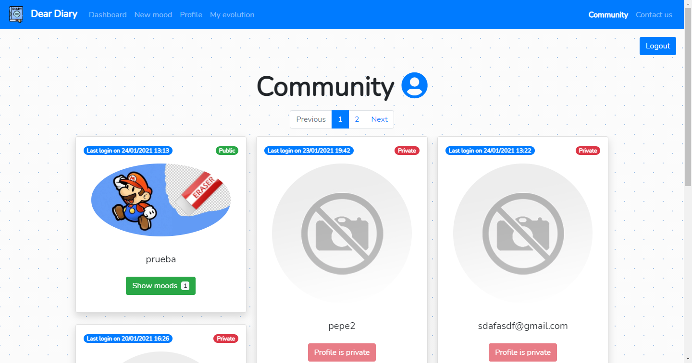

# dear_diary
dear_diary pretende ser un diario digital en formato de aplicación web, el cual permita a sus distintos usuarios
recopilar lo que les pasa día a día y que estos puedan puntuar sus estados o "moods"

## Estado
```diff
+ [En desarrollo]
+ [En producción]
```
-> dear-diary.iw (añadir a /etc/hosts la entrada: `155.210.71.69 dear-diary.iw`)

-> ¡dear-diary disponible en [dear-diary.ml](http://dear-diary.ml)!

## Cómo funciona la configuración
Se ha hecho uso del módulo [django-environ](https://django-environ.readthedocs.io/en/latest/)

Este módulo, permite definir a partir de variables de entorno distintas configuraciones para
distintos entornos, a partir de un fichero .env

En concreto, se debe crear un fichero .env en el directorio dear_diary, con las siguientes
variables de entorno:
```sh
- SECRET_KEY=[SECRET_KEY]
- DEBUG=[True|False]
- ALLOWED_HOSTS=[ALLOWED_HOST1,...,ALLOWED_HOSTN]
- SQLITE_URL=[sqlite:///full/path/to/sqlite/database]
- STATIC_ROOT=[full/path/to/static/]
- MEDIA_ROOT=[full/path/to/media/]
- EMAIL_HOST=[EMAIL_HOST]
- EMAIL_HOST_USER=[EMAIL_HOST_USER]
- EMAIL_HOST_PASSWORD=[EMAIL_HOST_PASSWORD]
- EMAIL_PORT=[EMAIL_PORT]
```

## Entorno de producción en Ubuntu 18.04 LTS
En el entorno de producción Ubuntu 18.04 LTS seguir los siguientes pasos para desplegar dear-diary
con el usuario `alumno`:

### Parte 1
- Ejecutar:
```sh
sudo apt-get update
sudo apt-get install apache2 apache2-dev
sudo apt-get install libapache2-mod-wsgi-py3
conda activate djangoEnv
conda install django
pip install django-environ
pip install django-widget-tweaks
pip install mod_wsgi-express
```
```sh
sudo mod_wsgi-express install-module
sudo vi /etc/apache2/mods-available/wsgi.load
```
- Pegar:
```sh
LoadModule wsgi_module /usr/lib/apache2/modules/mod_wsgi-py38.cpython-38-x86_64-linux-gnu.so
```
- Ejecutar:
```sh
sudo vi /etc/apache2/mods-available/wsgi.conf
```
- Pegar:
```sh
WSGIPythonHome /home/alumno/miniconda3
WSGIPythonPath /home/alumno/miniconda3/envs/djangoEnv/pyhton3.8
```
- Ejecutar:
```sh
sudo a2enmod wsgi
sudo service apache2 restart
```

### Parte 2
- Crear el fichero .env en el directorio dear_diary (con las variables de entorno descritas)
- Copiar el fichero apache_conf/dear_diary.conf en /etc/apache2/sites-available
- Ejecutar:
```sh
sudo a2ensite /etc/apache2/sites-available/dear_diary.conf
```
- Crear un directorio /var/www/dear_diary
- Copiar el fichero apache_conf/wsgi.py en /var/www/dear_diary
- Crear un directorio /var/www/dear_diary/media/avatars
- Crear un fichero /var/www/dear_diary/media/avatars/noimage.png (foto de perfil por defecto)
- Crear un fichero /var/www/dear_diary/db.sqlite3

### Parte 3
- Ir al directorio del proyecto y abrir una terminal
- Ejecutar:
```sh
conda activate djangoEnv
python manage.py collectstatic
python manage.py migrate
sudo service apache2 restart
```

### Parte 4 (opcional)
- Este apartado sirve para añadir seguridad al directorio /var/www
- Ejecutar:
```sh
sudo groupadd varwwwusers
sudo adduser www-data varwwwusers
sudo chgrp -R varwwwusers /var/www/
sudo chmod -R 770 /var/www/
```

> Con esto se consigue que el usuario www-data, que es el que ejecuta el daemon de apache2,
> sea el único que tenga permisos de rwx en el directorio donde residirá dear_diary, aparte
> del propio creador de /var/www

## Planificación
- [:white_check_mark:] v0.1.0 -> estructura básica del proyecto
- [:white_check_mark:] v0.2.0 -> landing page y página de registro


- [:white_check_mark:] v0.3.0 -> modelo de mood y dashborad de moods

- [:white_check_mark:] v0.4.0 -> CRUD de moods y logout


- [:white_check_mark:] v0.5.0 -> perfil del usuario


- [:white_check_mark:] v0.6.0 -> setup de producción
- [:white_check_mark:] v0.7.0 -> paginación dashboard y mejoras del diseño web-responsive

- [:white_check_mark:] v0.8.0 ->
mejoras en el renderizado de los formularios y redirección del usuario en Landing y SignUp si ya está logueado
- [:white_check_mark:] v0.9.0 -> formulario de contacto

- [:white_check_mark:] v0.10.0 -> footer
- [:white_check_mark:] v1.0.0 -> gráfico evolución puntuaje "moods"

- [:white_check_mark:] v1.1.0 -> estilos nuevos
- [:white_check_mark:] v1.2.0 -> ordenación dinámica de moods y añadida comunidad para ver los moods de los perfiles públicos


